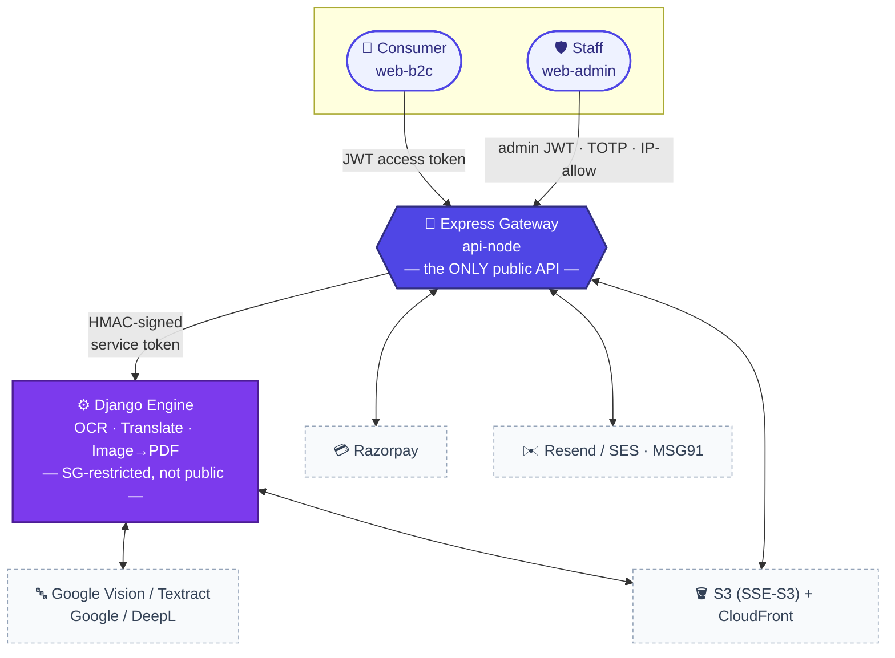
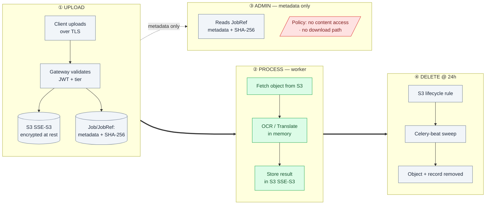
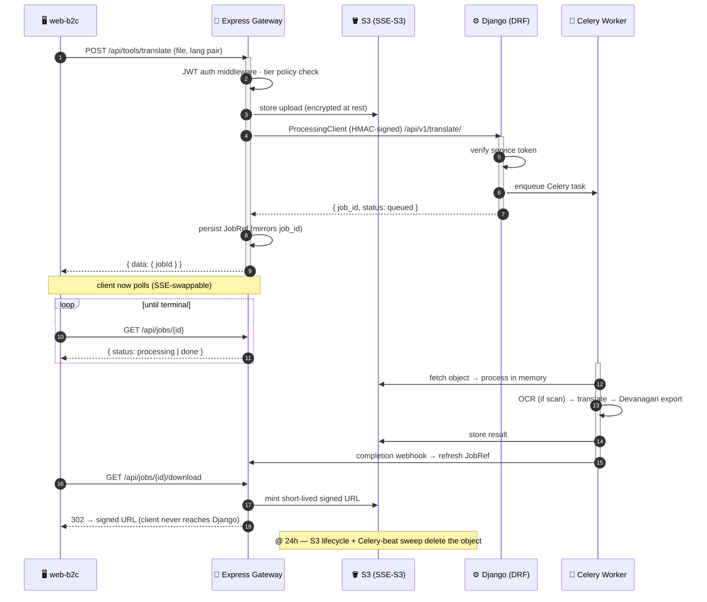
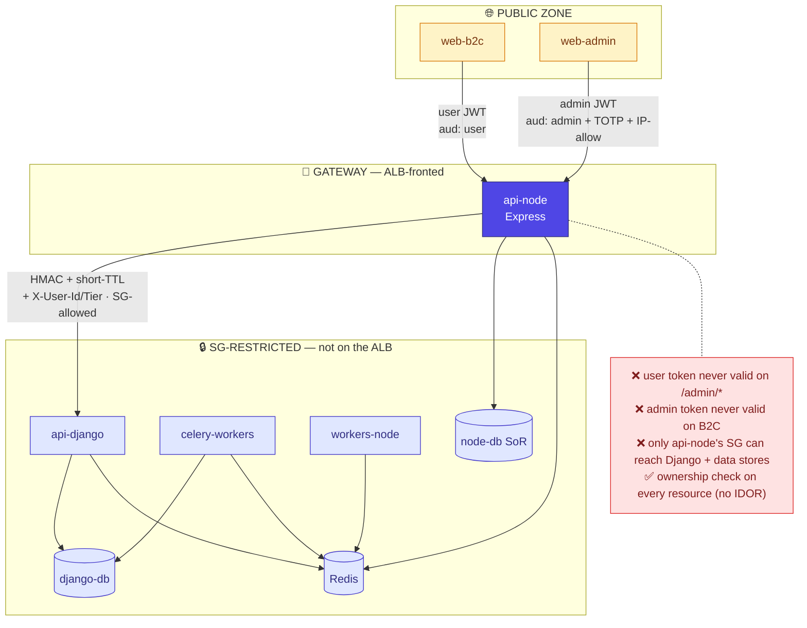
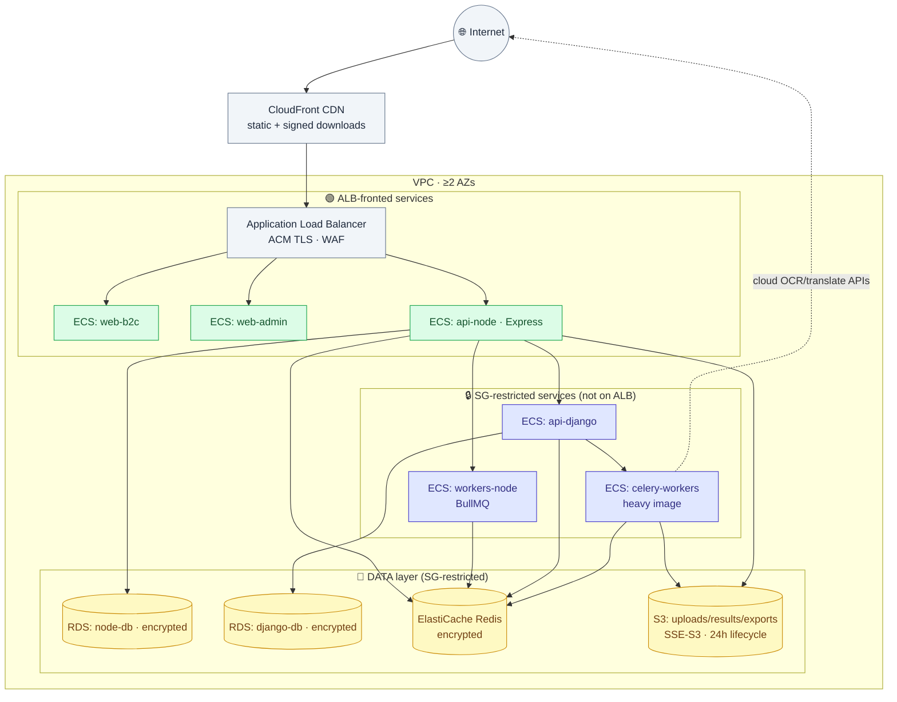
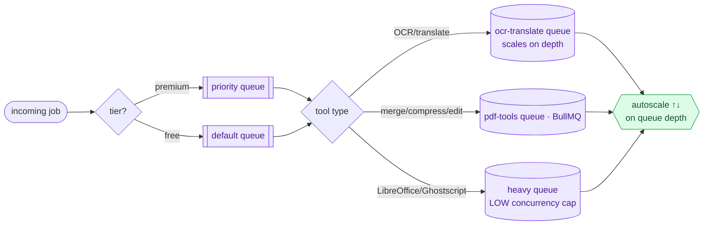
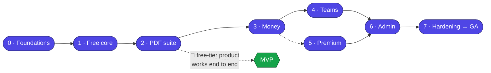
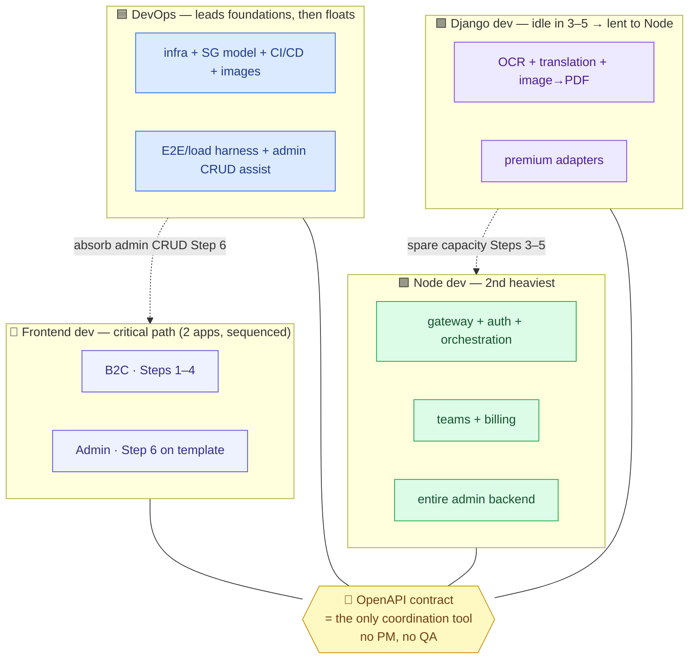

# SlashifyTech — Architecture in Diagrams

Visual companion to [ARCHITECTURE.md](ARCHITECTURE.md). Every diagram is **Mermaid** — it renders in VS Code's Markdown preview (with the Mermaid extension) and on GitHub. Read top to bottom: from the 10,000-ft system map down to sequences, data, and the build timeline.

> Backend: **Node 20 + Express** gateway · **Django 5 + DRF + Celery** processing engine.
> Security model: **JWT** auth throughout; files encrypted at rest via **S3 SSE-S3** + TLS in transit (no KMS envelope encryption). Django kept private by **security-group rules**, not a separate private subnet.

---

## 1. System context — who talks to what

The single most important rule lives here: the browser only ever reaches Express, and only Express reaches Django.

---

## 2. The three tiers, exploded

Every module, grouped by the tier and process that owns it.

---

## 3. Document lifecycle & privacy

Files are encrypted at rest by **S3 SSE-S3** (AES-256, S3-managed) and travel over TLS. Admins are restricted to metadata by **application + JWT scope policy**. Everything is deleted at 24h.

| Concern | Mechanism |
|---|---|
| At rest | S3 SSE-S3 (AES-256, S3-managed keys); RDS + ElastiCache encryption on |
| In transit | TLS everywhere (ACM on the ALB; internal TLS to Django) |
| Admin content lockout | application policy + JWT scope — admins have **no download route**, metadata only |
| Retention | 24h S3 lifecycle + Celery-beat sweep |

---

## 4. Request lifecycle — a translation job, end to end

---

## 5. Trust boundaries — what each token can do

No separate private subnet — Django and the data stores live in the same network but are reachable **only** via security-group rules that name the `api-node` security group as the sole source.

---

## 6. Data model — the two databases

> Solid relationship between **JOBREF** and **JOB** is logical, not a DB foreign key — they live in separate Postgres instances. `JobRef` (Node) caches status so history renders without re-querying Django.

---

## 7. AWS deployment topology

No dedicated private subnet tier — every service runs in the same subnets behind the VPC, and **security groups** enforce that only `api-node` reaches Django and the data stores. Only the public-facing services are attached to the ALB.

---

## 8. Worker queues & autoscaling signal

---

## 9. Build sequencing — the dependency timeline

The free-tier product works end to end after Step 2–3; everything after layers on without touching the processing path.

```mermaid
gantt
    title SlashifyTech build order (dependency-ordered)
    dateFormat X
    axisFormat %s

    section Foundations
    Step 0 · monorepo, CI/CD, bridge, JWT auth, BullMQ/Celery        :done, s0, 0, 2

    section Free-tier core
    Step 1 · auth, OCR + pre-processing, B2C dashboard              :active, s1, 2, 3
    Step 2 · PDF suite + image→PDF + editor/camera                 :s2, 5, 3
    Step 3 · Money — plans, Razorpay, GST, account settings        :s3, 8, 2

    section Expansion
    Step 4 · Teams — orgs, seats, invites, pooled billing          :s4, 10, 2
    Step 5 · Premium engines (Vision/Textract, Google/DeepL)       :s5, 12, 1

    section Staff plane
    Step 6 · Admin backend + second frontend (dashboard last)      :s6, 13, 3

    section Launch
    Step 7 · Hardening, E2E, load, DPDP, pen test → GA             :crit, s7, 16, 2
```

---

## 10. Role ownership map (who builds what)

---

*Rendering tip: in VS Code, install the **Markdown Preview Mermaid Support** extension, then open this file and press `Ctrl+Shift+V`. On GitHub these render automatically.*
