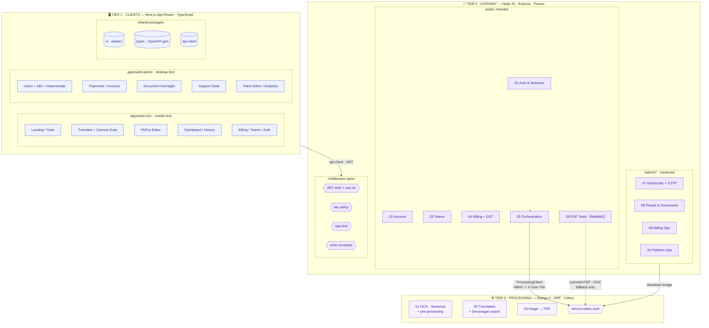
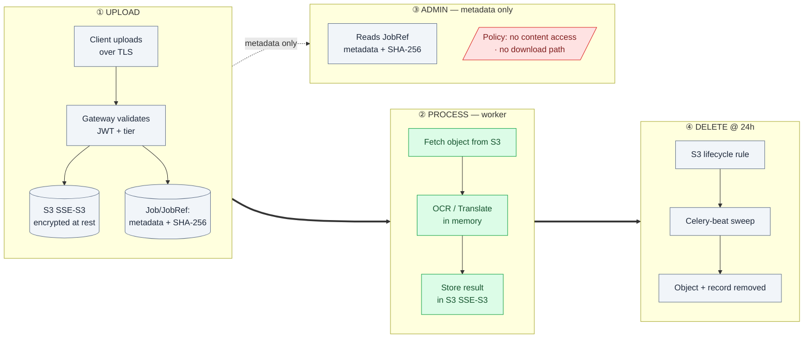
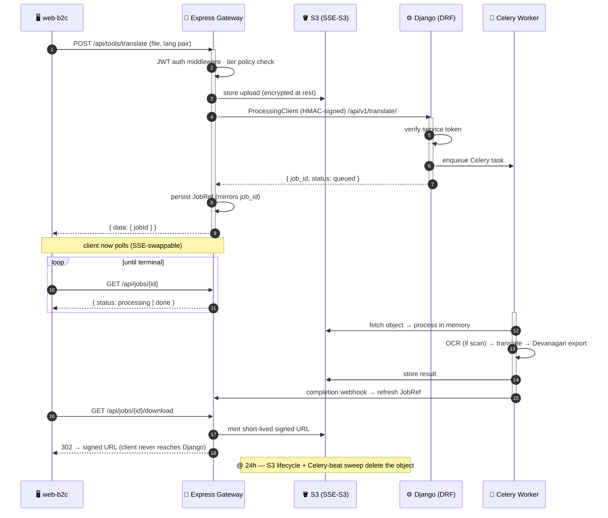
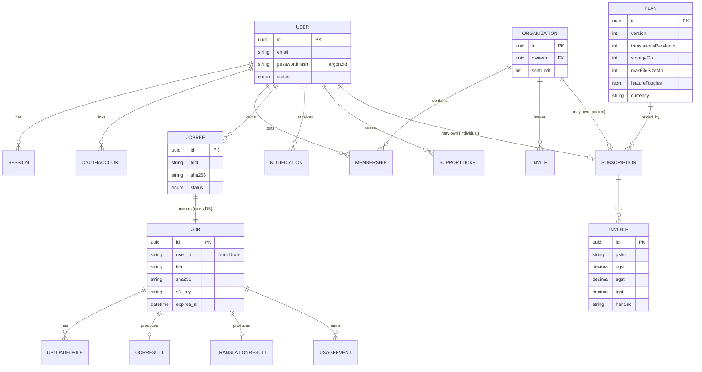
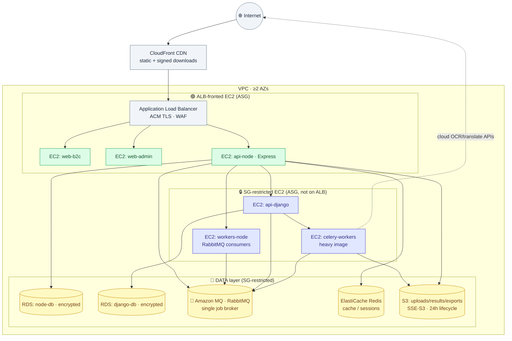
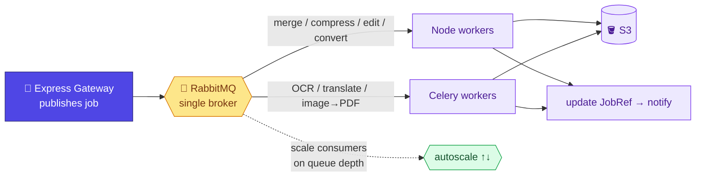

# SlashifyTech — Architecture in Diagrams

Visual companion to [ARCHITECTURE.md](ARCHITECTURE.md). Every diagram is **Mermaid** — it renders in VS Code's Markdown preview (with the Mermaid extension) and on GitHub. Read top to bottom: from the 10,000-ft system map down to sequences, data, deployment, and the queue.

> Backend: **Node 20 + Express** gateway · **Django 5 + DRF + Celery** processing engine.
> Queue: **RabbitMQ** is the single job broker — every async task runs through it, both Node tools (merge, compress, edit, convert) and Django/Celery (OCR, translate, image→PDF). Redis is used only for cache/sessions/rate-limits.
> Security model: **JWT** auth throughout; files encrypted at rest via **S3 SSE-S3** + TLS in transit (no KMS envelope encryption). Django kept private by **security-group rules**, not a separate private subnet.

---

## 1. System context — who talks to what

The single most important rule lives here: the browser only ever reaches Express, and only Express reaches Django.

---

## 2. The three tiers, exploded

Every module, grouped by the tier and process that owns it.

---

## 3. Document lifecycle & privacy

Files are encrypted at rest by **S3 SSE-S3** (AES-256, S3-managed) and travel over TLS. Admins are restricted to metadata by **application + JWT scope policy**. Everything is deleted at 24h.

| Concern | Mechanism |
|---|---|
| At rest | S3 SSE-S3 (AES-256, S3-managed keys); RDS + ElastiCache encryption on |
| In transit | TLS everywhere (ACM on the ALB; internal TLS to Django) |
| Admin content lockout | application policy + JWT scope — admins have **no download route**, metadata only |
| Retention | 24h S3 lifecycle + Celery-beat sweep |

---

## 4. Request lifecycle — a translation job, end to end

---

## 5. Data model — the two databases

> Solid relationship between **JOBREF** and **JOB** is logical, not a DB foreign key — they live in separate Postgres instances. `JobRef` (Node) caches status so history renders without re-querying Django.

---

## 6. AWS deployment topology

Compute runs on **EC2** (Auto Scaling Groups, one per service role). No dedicated private subnet tier — every instance runs in the same subnets behind the VPC, and **security groups** enforce that only `api-node` reaches Django and the data stores. Only the public-facing instances are attached to the ALB.

---

## 7. One queue for everything — RabbitMQ

Every async task goes through **RabbitMQ**. The gateway publishes a job; the right worker pool consumes it. Node tools and Django/Celery share the same broker — nothing heavy runs inline in a request.

---

*Rendering tip: in VS Code, install the **Markdown Preview Mermaid Support** extension, then open this file and press `Ctrl+Shift+V`. On GitHub these render automatically.*
